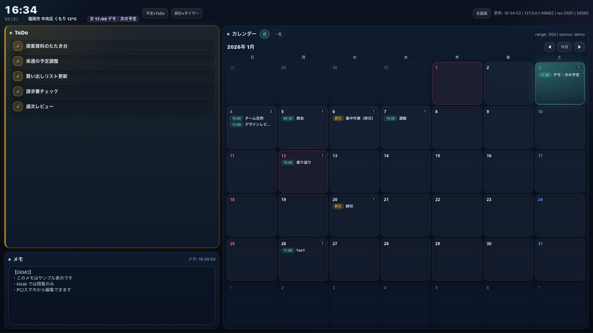
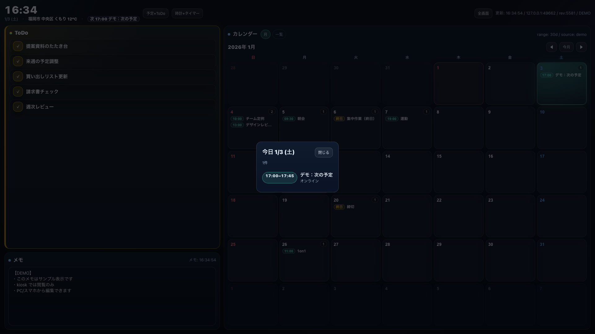
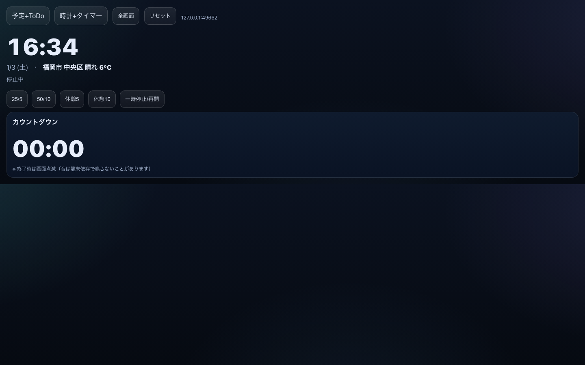

# Desk Screen（タブレット常時表示ダッシュボード）

Always-on tablet dashboard (Calendar / Todo / Memo / Weather).



Mac側で軽量HTTPサーバを動かし、dタブレットはブラウザで開きっぱなしにする構成です。

## できること

- `/` … 日時/天気 + カレンダー（月表示: 予定をマス内に表示 / 祝日は赤）+ ToDo（Local or Google Tasks）+ メモ
- `/timer` … 大時計 + ポモドーロ（25/5・50/10）
  - タブレット（タッチ端末）ではメモはデフォルト閲覧専用（入力しない想定）

## Screenshots




## Demo mode（サンプル表示）

予定/ToDo/メモを **サンプル表示** にしたい場合（ポートフォリオ用スクショ等）:

- `/?demo=1`
- `/?kiosk=1&demo=1`

## 起動（1コマンド）

```bash
~/desk
```

起動するとURLが表示されます（ポートは自動で衝突回避します）。

停止/再起動/確認:

```bash
~/desk stop
~/desk restart
~/desk status
```

（デバッグで直接起動したい場合）

```bash
cd ~/desk_screen
python3 server.py
```

## 設定の保存（.env）

`~/desk_screen/.env`（`~/desk_screen/.env.example` をコピー）に `DESK_SCREEN_...` を書いておくと、起動時に自動で読み込みます。

例:

```bash
DESK_SCREEN_CALENDAR_SOURCE=google
DESK_SCREEN_CALENDAR_RANGE=1m
```

### 天気/気温（Open‑Meteo）

デフォルトで「天気 + 気温」を表示します（約10分キャッシュ）。

場所指定（どちらか）:

```bash
# 都市名（ジオコーディング）
DESK_SCREEN_WEATHER_CITY=東京

# 緯度経度（任意で表示名）
DESK_SCREEN_WEATHER_LAT=35.681236
DESK_SCREEN_WEATHER_LON=139.767125
DESK_SCREEN_WEATHER_LABEL=東京
```

無効化:

```bash
DESK_SCREEN_WEATHER_ENABLE=0
```

## ポートについて（衝突しない工夫）

- 初回起動時に「空いているポート」を自動選択して起動します（他プロセスと被らない）。
- 選ばれたポートは `~/desk_screen/port.txt` に保存され、次回以降も基本は同じポートを使います。
- もし固定したい場合は環境変数で指定できます（使用中なら自動で別ポートに逃げます）:

```bash
DESK_SCREEN_PORT=58080 python3 server.py
```

## タブレット側で開く

同じWi‑Fiに接続して、タブレットのブラウザで開きます。

- `http://<MacのIP>:<表示されたポート>/?kiosk=1`（壁掛け/常時表示向け）
- `http://<MacのIP>:<表示されたポート>/timer`

同一ネットワークで Bonjour/mDNS が使える環境なら、IPが変わっても `.local` でアクセスできます:

- `http://<MacのLocalHostName>.local:<表示されたポート>/?kiosk=1`

## 全画面（おすすめ）

- 画面右上の「全画面」または「タップで全画面」から切替できます
- 全画面中は上部バーが数秒で自動的に隠れます（タップで再表示）

## Calendar取得（初回の権限）

初回実行時に「カレンダーへのアクセス許可」が出るので許可してください。

## Google Calendar（任意・直同期）

すでにMacのCalendar.appにGoogleアカウントを追加している場合は、この仕組み（AppleScript）だけでGoogleカレンダーも表示できます。

## Google Calendar + Google ToDo（おすすめ: OAuth / 直取得）

Googleアカウントから **Google Calendar / Google ToDo（= Google Tasks）** を直接取得したい場合は、1回だけOAuth設定します。

前提:

- **Google Calendar API** / **Google Tasks API** を有効化
  - 基本は「OAuthクライアントのGCPプロジェクト」でON
  - もしクライアントのプロジェクトに権限が無い/不明な場合は、Quota Project で回避できます（下を参照）

セットアップ（OAuthクライアントJSON/既存トークンJSONから `client_id` / `client_secret` を流用）:

```bash
cd ~/desk_screen
python3 setup_google_oauth.py --from <YOUR_OAUTH_JSON_PATH> --open
```

`.env` に `DESK_SCREEN_GOOGLE_OAUTH_FROM` を設定している場合は、これだけでもOKです:

```bash
~/desk oauth
```

完了すると `~/desk_screen/credentials/user_oauth_token.json` が作成されます。

```bash
~/desk restart
```

`/` の ToDo のタブを `Google` にするとGoogle ToDoが表示されます。  
カレンダーは自動で `google_oauth` が優先されます（失敗時はApple/サービスアカウントにフォールバック）。

### 403「API has not been used…」が出て直らない場合（Quota Project）

`HTTP 403 ... API has not been used in project XXXXX before or it is disabled` が出る場合、OAuthクライアントのプロジェクト側が原因のことがあります。

そのプロジェクトに権限が無い/触れない場合は、**自分が権限を持つGCPプロジェクト**を Quota Project に指定して回避できます。

1) Quota Projectを決める（例: `my-quota-project-123` など）
2) そのプロジェクトでAPIを有効化:

```bash
gcloud services enable calendar-json.googleapis.com tasks.googleapis.com --project=<YOUR_PROJECT_ID>
```

3) `~/desk_screen/.env` に保存:

```bash
DESK_SCREEN_GOOGLE_QUOTA_PROJECT=<YOUR_PROJECT_ID>
```

4) 再起動:

```bash
~/desk restart
```

### どのカレンダーを読むか（重要）

デフォルトは **Google Calendarで「表示/選択中」のカレンダーを自動で統合**します（primary固定ではありません）。
必要なら `.env` で変更できます:

```bash
DESK_SCREEN_GOOGLE_CALENDAR_MODE=selected  # (default) 選択中+primary
DESK_SCREEN_GOOGLE_CALENDAR_MODE=primary   # primaryのみ
DESK_SCREEN_GOOGLE_CALENDAR_MODE=all       # 全カレンダー
DESK_SCREEN_GOOGLE_CALENDAR_IDS=id1,id2    # ID指定（最優先）
```

カレンダーIDを確認したい場合:

```bash
~/desk calendars
```

### カレンダーの表示範囲（わかりやすく調整）

デフォルトは **30日先まで** です。環境変数で変更できます（例）:

```bash
DESK_SCREEN_CALENDAR_RANGE=1m  ~/desk restart   # 1ヶ月（=30日）
DESK_SCREEN_CALENDAR_RANGE=4w  ~/desk restart   # 4週（=28日）
DESK_SCREEN_CALENDAR_RANGE=14d ~/desk restart   # 14日
DESK_SCREEN_CALENDAR_DAYS=7    ~/desk restart   # 7日（数値のみ）
```

「Macに同期させず、Google Calendarから直接読む」場合はサービスアカウントで取得できます。

1) Google Calendarの設定 → 対象カレンダー → **共有** で、サービスアカウントメールを追加  
（権限は「予定の表示（すべての予定の詳細）」推奨）

2) Google Calendarの設定 → 対象カレンダー → **統合** の **カレンダーID** を控える  
（通常はあなたのメールアドレスに近い文字列）

3) 設定ファイルを作成:

```bash
cd ~/desk_screen
cp google_calendar.example.json google_calendar.json
```

`google_calendar.json` の `calendar_ids` をあなたのカレンダーIDに書き換えます。

（共有後にIDを確認したい場合）

```bash
cd ~/desk_screen
./list_google_calendars.py
```

（共有済みのカレンダーを自動で `google_calendar.json` に書きたい場合）

```bash
cd ~/desk_screen
./configure_google_calendar.py <calendarId>
```

4) 再起動すると、`/` の右上ステータスに `google` が表示されます（失敗時は `google error: ...`）。

## ToDo運用

`~/desk_screen/todo.txt` をMacで編集するだけです。

タブレットから追加/完了したい場合は `/` 画面の ToDo から操作できます。

- `Google` タブ: Google ToDo（Google Tasks）
- `Local` タブ: `todo.txt`

## メモ

- 保存先: `~/desk_screen/memo.txt`
- PC/スマホから: `/` 画面の「メモ」欄（編集 + 保存）
- タブレット（kiosk）: デフォルト閲覧のみ

### ToDo編集の保護（任意）

同一Wi‑Fi内から誰でも書き換え可能にしたくない場合はトークンを設定できます。

- `~/desk_screen/.env` に `DESK_SCREEN_TODO_TOKEN=...` を設定
- もしくは `~/desk_screen/todo_token.txt` にトークン文字列を1行で保存

設定した場合、タブレット側は一度だけ `http://<MacのIP>:<port>/?token=<トークン>` で開いてください（以降は端末に保存されます）。

## 常時稼働（任意：launchd）

ログイン時に自動起動したい場合は `launchd` を使います。

有効化（インストール+起動）:

```bash
cd ~/desk_screen
./launchd_enable.sh
```

無効化（停止+アンインストール）:

```bash
cd ~/desk_screen
./launchd_disable.sh
```

`launchd_enable.sh` が `~/Library/LaunchAgents/` 用の plist を自動生成するので、通常は手で編集不要です。
